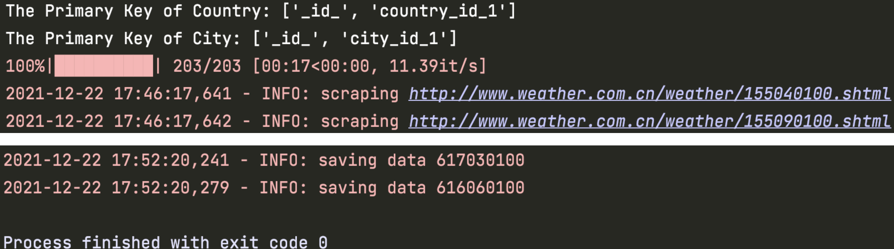

# WeatherSpider
爬取全球6000个城市的最近7天天气预报，使用的数据库为 `MongoDB`。

分成三个步骤：

1. 在主页抓取国家列表，拿到每个国家对应的 `country_id`，保存到 Mongo 中，共 207 个国家，数据结构为：

   ```json
   {
       "_id" : ObjectId("61bf46a7de5733cb2a0e509c"),
       "country_id" : 163,
       "continent_id" : 0,
       "continent_name_en" : "Asia",
       "continent_name_zh" : "亚洲",
       "country_name_en" : "Afghanistan",
       "country_name_zh" : "阿富汗",
       "last_crawl_time" : "2021-12-19 23:47:11"
   }
   ```

2. 对于每一个国家抓取其城市列表，拿到每个城市对应的 `city_id`，保存到Mongo 中。共5970个城市。
3. 对于每一个城市，抓取其天气页的信息，保存到 Mongo 中，数据结构如下：

```json
{
    "_id" : ObjectId("61bf46adde5733cb2a0e5f58"),
    "city_id" : 222120100,
    "city_name_en" : "Nyhamn",
    "city_name_zh" : "尼汉姆",
    "continent_id" : 1,
    "continent_name_en" : "Europe",
    "continent_name_zh" : "欧洲",
    "country_id" : 133,
    "country_name_en" : "Finland",
    "country_name_zh" : "芬兰",
    "is_capital" : false,
    "last_crawl_time" : "2021-12-19 23:01:51",
    "weather_1" : {
        "date" : "19日（今天）",
        "weather" : "小雪",
        "temperature" : "-2℃"
    },
    "weather_2" : {
        "date" : "20日（明天）",
        "weather" : "阴转小雪",
        "temperature" : "-1℃/-4℃"
    },
    "weather_3" : {
        "date" : "21日（后天）",
        "weather" : "多云转阴",
        "temperature" : "-3℃/-6℃"
    },
    "weather_4" : {
        "date" : "22日（周三）",
        "weather" : "阴转小雪",
        "temperature" : "0℃/-4℃"
    },
    "weather_5" : {
        "date" : "23日（周四）",
        "weather" : "雨夹雪转小雪",
        "temperature" : "0℃/-3℃"
    },
    "weather_6" : {
        "date" : "24日（周五）",
        "weather" : "小雪转中雪",
        "temperature" : "-2℃/-4℃"
    },
    "weather_7" : {
        "date" : "25日（周六）",
        "weather" : "中雪转小雪",
        "temperature" : "-3℃/-5℃"
    }
}
```

因为使用异步爬虫，所以只需要6分钟就能跑完了。



